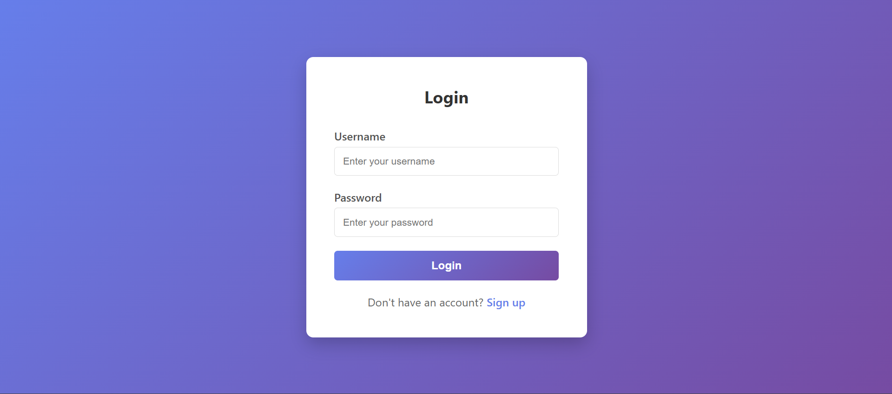
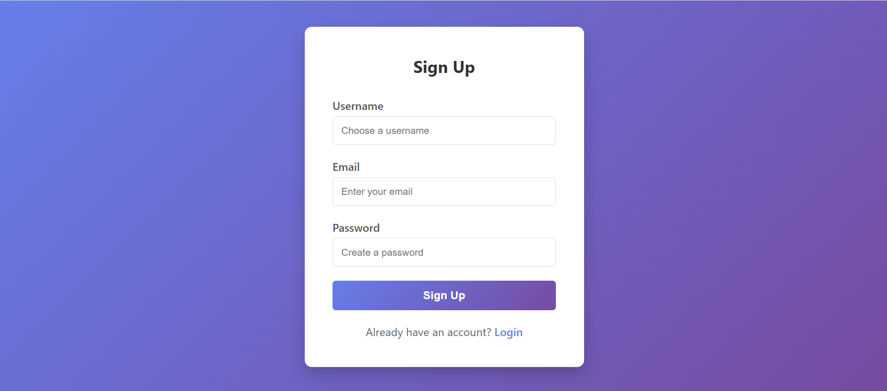
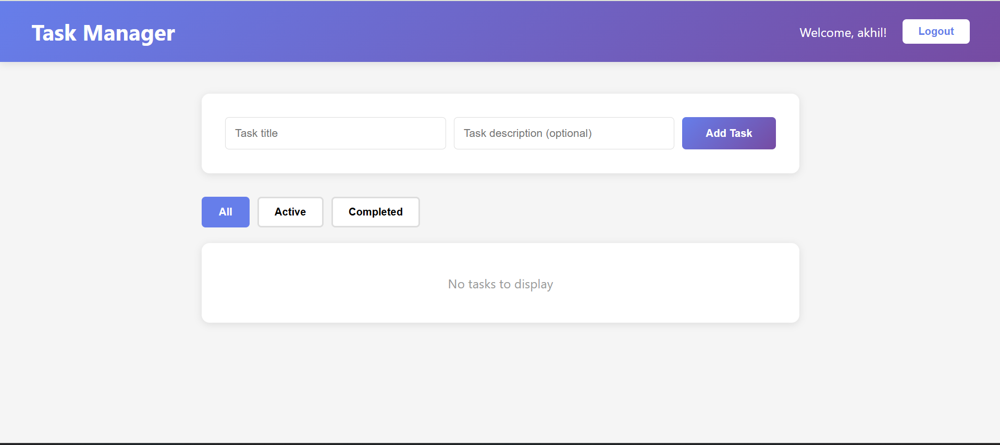
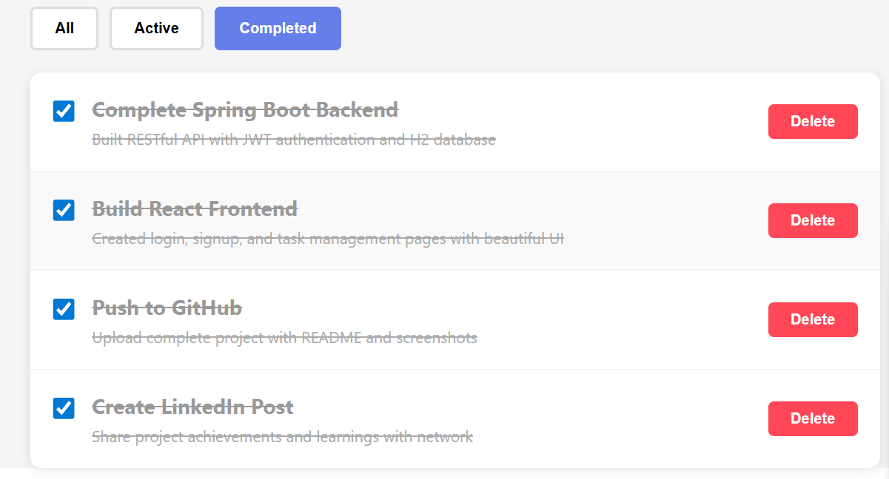

# 📝 Task Manager Application

A full-stack task management application built with **Spring Boot** (backend) and **React** (frontend). This application allows users to register, login, and manage their daily tasks with a clean and intuitive interface.

  

---

## 🚀 Features

- ✅ **User Authentication** - Secure JWT-based authentication
- ✅ **User Registration** - Create new accounts with email validation
- ✅ **Task Management** - Create, read, update, and delete tasks
- ✅ **Task Filtering** - Filter tasks by status (All, Active, Completed)
- ✅ **Mark as Complete** - Toggle task completion status
- ✅ **Responsive Design** - Beautiful UI that works on all devices
- ✅ **RESTful API** - Well-structured backend API endpoints
- ✅ **Secure** - Password encryption and JWT token authentication

---

## 🛠️ Tech Stack

### **Backend:**
- **Java 21**
- **Spring Boot 3.x**
- **Spring Security** (JWT Authentication)
- **Spring Data JPA**
- **H2 Database** (In-memory for development)
- **Maven**
- **Lombok**

### **Frontend:**
- **React 18**
- **JavaScript (ES6+)**
- **Axios** (HTTP Client)
- **CSS3** (Custom styling with gradients)
- **HTML5**

---

## 📸 Screenshots

### Login Page


### Signup Page


### Task Dashboard


### Task Filtering


---

## 📦 Installation & Setup

### **Prerequisites:**
- Java 21 or higher
- Node.js 18+ and npm
- Git
- IntelliJ IDEA / Eclipse (for backend)
- VS Code (for frontend)

### **1. Clone the Repository:**
```bash
git clone https://github.com/akhilkoyyada145-blip/task-manager-app.git
cd task-manager-app
```

### **2. Backend Setup:**
```bash
# Checkout main branch (backend)
git checkout main

# Navigate to backend directory
cd task-manager-backend

# Run the Spring Boot application
./mvnw spring-boot:run

# Or in IntelliJ IDEA: Right-click on TaskManagerBackendApplication.java → Run
```

Backend will start on: **http://localhost:8080**

### **3. Frontend Setup:**

Open a new terminal:
```bash
# Checkout frontend branch
git checkout frontend

# Navigate to frontend directory
cd task-manager-frontend

# Install dependencies
npm install

# Start the React development server
npm start
```

Frontend will start on: **http://localhost:3000**

---

## 🌐 API Endpoints

### **Authentication:**

| Method | Endpoint | Description |
|--------|----------|-------------|
| POST | `/api/auth/register` | Register new user |
| POST | `/api/auth/login` | Login user and get JWT token |

### **Tasks (Protected - Requires JWT Token):**

| Method | Endpoint | Description |
|--------|----------|-------------|
| GET | `/api/tasks` | Get all tasks for logged-in user |
| GET | `/api/tasks/status/{completed}` | Get tasks by status |
| GET | `/api/tasks/{id}` | Get task by ID |
| POST | `/api/tasks` | Create new task |
| PUT | `/api/tasks/{id}` | Update task |
| DELETE | `/api/tasks/{id}` | Delete task |

---

## 📝 API Request Examples

### **Register User:**
```json
POST /api/auth/register
Content-Type: application/json

{
  "username": "akhil",
  "email": "akhil@example.com",
  "password": "password123"
}
```

### **Login:**
```json
POST /api/auth/login
Content-Type: application/json

{
  "username": "akhil",
  "password": "password123"
}
```

### **Create Task:**
```json
POST /api/tasks
Authorization: Bearer <your-jwt-token>
Content-Type: application/json

{
  "title": "Complete project documentation",
  "description": "Write comprehensive README and API docs",
  "completed": false
}
```

---

## 🗄️ Database Configuration

Currently using **H2 in-memory database** for development.

**H2 Console:** http://localhost:8080/h2-console

**Connection Details:**
- JDBC URL: `jdbc:h2:mem:taskdb`
- Username: `sa`
- Password: (empty)

**For Production:** Replace H2 with PostgreSQL or MySQL in `application.properties`

---

## 🔒 Security

- Passwords are encrypted using **BCrypt**
- JWT tokens expire after **24 hours**
- CORS is configured to allow frontend (localhost:3000)
- All task endpoints require authentication

---

## 🚀 Future Enhancements

- [ ] Deploy backend to Railway/Render
- [ ] Deploy frontend to Vercel/Netlify
- [ ] Add task due dates and reminders
- [ ] Add task priorities (High, Medium, Low)
- [ ] Add task categories/tags
- [ ] Add search functionality
- [ ] Add user profile management
- [ ] Add task sharing between users
- [ ] Switch to PostgreSQL for production
- [ ] Add email notifications
- [ ] Add dark mode toggle

---

## 👨‍💻 Author

**Akhil Koyyada**
- GitHub: [@akhilkoyyada145-blip](https://github.com/akhilkoyyada145-blip)
- Email: akhilkoyyada145@gmail.com

---

## 📄 License

This project is open source and available for learning purposes.

---

## 🙏 Acknowledgments

- Spring Boot Documentation
- React Documentation
- JWT.io for JWT token information

---

**⭐ If you find this project helpful, please give it a star on GitHub!**